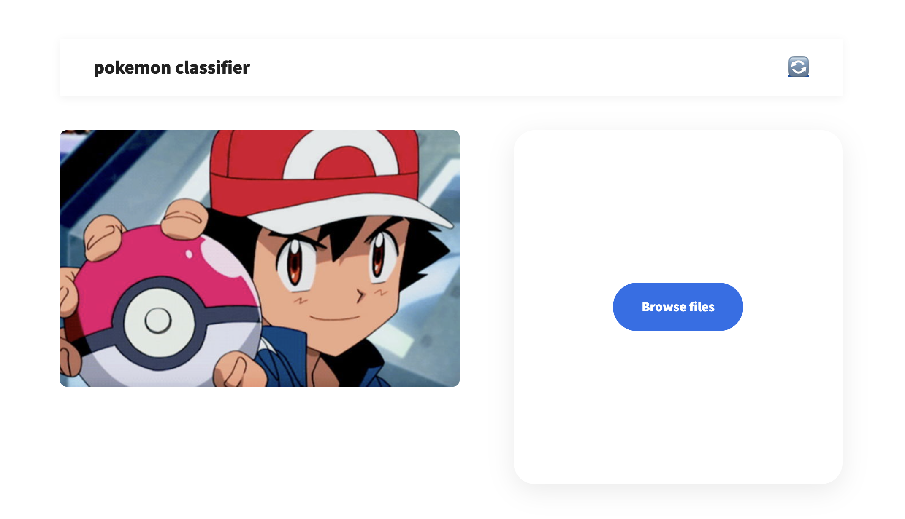

# Pokemon Image Classification

## 1. Task Description
본 프로젝트는 포켓몬 이미지를 입력받아 해당 포켓몬의 클래스를 분류하는 이미지 분류 모델을 구현하는 것을 목표로 한다.  
총 300개의 클래스에 대해 분류를 수행하였다.

---

## 2. Main Features (기능 설명)

### (1) 모델 학습 기능
- ResNet18 / ResNet50 기반 모델 학습
- pretrained / scratch 학습 비교
- head-only / full fine-tuning 설정 가능

---

### (2) 데이터 처리 기능
- 이미지 크기 조정 (Resize)
- 데이터 증강 (flip, rotation, color jitter)
- train / validation / test 분리

---

### (3) 모델 평가 기능
- Accuracy, Precision, Recall, F1-score 계산
- 여러 모델 성능 비교

---

### (4) GUI 기능 (Streamlit)
- 이미지 업로드를 통한 포켓몬 분류
- 업로드 이미지 미리보기
- 예측 결과 출력
- Restart 버튼을 통한 초기화 기능

---

## 3. Model & Training Settings

- Models: ResNet18, ResNet50
- Pretrained: ImageNet pretrained / scratch
- Fine-tuning:
  - Head-only (fc layer만 학습)
  - Full fine-tuning (전체 layer 학습)
- Input size: 160 × 160
- Optimizer: Adam
- Loss: CrossEntropyLoss
- Epochs: 5

---

## 4. Experiments

| Model | Accuracy | Precision | Recall | F1 |
|------|--------|----------|--------|----|
| ResNet18 (head) | 0.3841 | 0.5537 | 0.3675 | 0.3772 |
| ResNet18 (full) | 0.8792 | 0.9060 | 0.8825 | 0.8827 |
| ResNet50 (full) | 0.9143 | 0.9334 | 0.9211 | 0.9195 |
| ResNet50 (scratch) | 0.3258 | 0.4131 | 0.3398 | 0.3150 |

---

## 5. Analysis

### (1) Pretrained vs Scratch ⭐
ResNet50 pretrained 모델의 정확도는 91.43%인 반면,  
scratch 모델은 32.58%로 매우 낮은 성능을 보였다.

이는 ImageNet으로 사전 학습된 feature가  
포켓몬 이미지 분류에 효과적으로 활용되었기 때문이다.

---

### (2) Fine-tuning Effect
ResNet18_head (38.41%)와 ResNet18_full (87.92%)를 비교하면,  
fine-tuning을 적용한 모델이 훨씬 높은 성능을 보였다.

이는 backbone 전체를 학습하면서  
데이터에 맞는 특징을 더 잘 학습했기 때문이다.

---

### (3) Model Size Comparison
ResNet50_full (91.43%)는 ResNet18_full (87.92%)보다  
더 높은 성능을 보였다.

이는 deeper network가 더 복잡한 특징을 학습할 수 있기 때문이다.

---

### (4) Recall Analysis
Recall 또한 pretrained + fine-tuning 모델에서 가장 높게 나타났으며,  
이는 클래스 간 구분 능력이 향상되었음을 의미한다.

---

## 6. Demo


### Full Video
[Watch Video](assets/demo.mp4)

Streamlit 기반 GUI를 통해 이미지를 업로드하면  
포켓몬 클래스 예측 결과를 확인할 수 있다.

---

## 7. Conclusion

- Transfer learning(pretrained)이 성능 향상에 매우 중요한 역할을 한다.
- Fine-tuning은 모델 성능을 크게 개선한다.
- 더 깊은 모델(ResNet50)이 더 높은 성능을 보였다.


## How to Run

```bash
streamlit run app.py